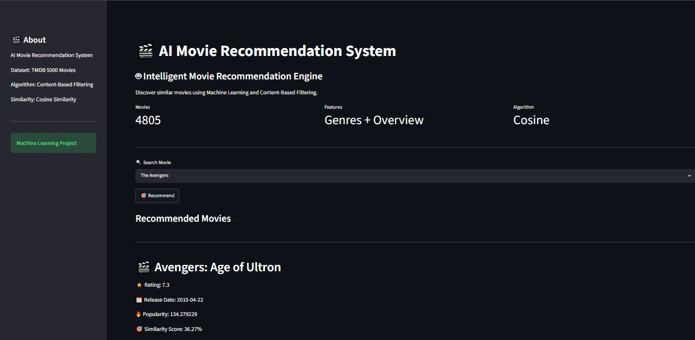

# AI Movie Recommendation System

## Overview
Content-based movie recommendation system built using Machine Learning.

## Preview

## Features
- Search movies
- Top 5 recommendations
- Similarity score
- Rating
- Release date
- Popularity
- Overview

## Tech Stack
- Python
- Streamlit
- Pandas
- Scikit-Learn

## Dataset
TMDB 5000 Movies Dataset

## Machine Learning
CountVectorizer + Cosine Similarity

## How to Run

pip install -r requirements.txt

python -m streamlit run app.py